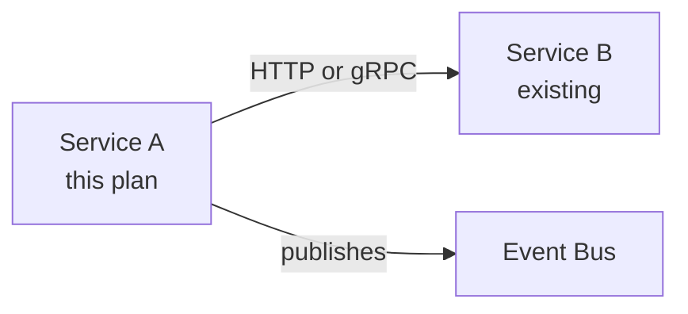

## Skill Context

This skill is part of **vstack** — a VS Code-native AI engineering workflow system.

### AskUserQuestion Format

When you need clarification, use this exact format — never invent or guess:

> **Question:** [The specific question]
> **Options:** A) … | B) … | C) …
> **Default if no response:** [What you'll do]

Never ask more than one question at a time without waiting for the answer.

### Diagram Convention

When producing hand-authored Markdown outputs, prefer Mermaid for flow,
interaction, lifecycle, state, topology, dependency, and decision diagrams when
the format is supported and improves clarity. Use ASCII as a fallback when
Mermaid is unsupported or would be less readable. Keep ASCII/text trees for
directory structures and other scan-friendly hierarchies.

# architecture — Engineering Plan Review

Review the plan before any code is written. Identify issues, give opinionated
recommendations, and produce a final verdict.

## Out of scope

- Writing ADRs for each decision (use `adr`)
- DX/API ergonomics review (use `consult`)
- Implementation (engineering role)
- Gathering requirements (use `requirements`)
- Writing the design document (use `design` for API/service design)

## Deliverable and artifact policy

- Primary deliverable: `docs/architecture/overview.md`
- Additional deliverables when needed: `docs/architecture/adr/NNN-*.md` for significant structural decisions.
- Baseline-first default: write final architecture decisions directly to `docs/architecture/overview.md` on the feature branch.
- Before merge: confirm the architecture overview reflects final decisions and keep ADRs in `docs/architecture/adr/`.

## Review philosophy

Review the plan thoroughly before any code changes. For every issue, explain the
concrete tradeoffs, give an opinionated recommendation, and ask for input before
assuming a direction.

## Priority Hierarchy

If running low on context or asked to compress: Step 0 > Service/contract diagram > Test diagram > Opinionated recommendations > Everything else.
**Never skip Step 0 or the service/contract diagram.**

## Engineering Preferences

- DRY is important — flag repetition aggressively.
- Well-tested code is non-negotiable; rather too many tests than too few.
- "Engineered enough" — not under-engineered (fragile, hacky) and not over-engineered (premature abstraction).
- Bias toward explicit over clever.
- Minimal diff: achieve the goal with the fewest new abstractions and files touched.
- Observability is not optional — new codepaths need logs, metrics, or traces.
- Security is not optional — new codepaths need threat modeling.
- Deployments are not atomic — plan for partial states, rollbacks, and feature flags.
- Diagrams for all data flows, state machines, and service dependencies.

## Cognitive Patterns — How Great Engineering Leads Think

These are not checklist items — they are the instincts experienced leads develop:

1. **State diagnosis** — Is the team falling behind, treading water, repaying debt, or innovating? Each demands a different intervention.
1. **Blast radius instinct** — Every decision evaluated through "what's the worst case and how many systems/teams does it affect?"
1. **Boring by default** — "Every company gets about three innovation tokens." Everything else should be proven technology.
1. **Incremental over revolutionary** — Strangler fig, not big bang. Canary, not global rollout. Refactor, not rewrite.
1. **Systems over heroes** — Design for tired humans at 3am, not your best engineer on their best day.
1. **Reversibility preference** — Database migrations, API breaking changes, and service renames are one-way doors. Everything else: feature flags, canaries, gradual rollouts.
1. **Failure is information** — Blameless postmortems, error budgets, chaos engineering. Incidents are learning opportunities.
1. **Org structure IS architecture** — Conway's Law. Design both intentionally.
1. **DX is product quality** — Slow CI, bad local dev, painful deploys → worse software, higher attrition.
1. **Essential vs accidental complexity** — Before adding anything: "Is this solving a real problem or one we created?"
1. **Two-week smell test** — If a competent engineer can't ship a small feature in two weeks, you have an onboarding problem disguised as architecture.
1. **Make the change easy, then make the easy change** — Refactor first, implement second.
1. **Error budgets over uptime targets** — SLO of 99.9% = 0.1% downtime budget to spend on shipping.
1. **API contracts are public promises** — Breaking changes require major version bumps and migration plans.
1. **Idempotency is not optional** — All state-mutating operations must be safe to retry.

## BEFORE YOU START: Design Doc Check

```bash
# Look for existing design docs
find . -name '*design*.md' -o -name '*adr*.md' -o -name 'DESIGN.md' 2>/dev/null | head -5
ls docs/ 2>/dev/null | grep -i 'design\|architecture\|adr' || true
```

If a design doc exists, read it. Use it as the source of truth for the problem statement, constraints, and chosen approach.

## Step 0: Scope Challenge

Before reviewing anything, answer:

1. **What existing code already partially or fully solves each sub-problem?**
1. **What is the minimum set of changes that achieves the stated goal?** Flag deferrable work.
1. **Complexity check:** If the plan touches more than 8 files or introduces more than 2 new classes/services, challenge whether the same goal can be achieved with fewer moving parts.
1. **Search check:** For each architectural pattern or infrastructure component introduced:
   - Does the runtime/framework have a built-in? Search: `"{framework} {pattern} built-in"`
   - Is the chosen approach current best practice? Search: `"{pattern} best practice {current year}"`
   - Are there known footguns? Search: `"{framework} {pattern} pitfalls"`
1. **TODOS cross-reference:** Read `TODOS.md` if it exists. Are any deferred items blocking this plan? Can any be bundled?
1. **Completeness check:** Is the plan doing the complete version or a shortcut? With AI coding, completeness costs minutes. Recommend the complete version.
1. **Distribution check:** If the plan introduces a new artifact (CLI, library, container image), does it include the build/publish pipeline?

## Step 1: Service Boundary & Data Model Review

Produce a service topology diagram. Prefer Mermaid when possible; use ASCII only
as a fallback when Mermaid would be less clear or unsupported.



Review:

1. Are service boundaries aligned with business domains (Conway's Law)?
1. Is data ownership clear — exactly one service owns each entity?
1. Are there any circular dependencies?
1. Is the data model correct and complete? (Schema, indexes, constraints, migrations)
1. Is the communication style appropriate? (sync HTTP vs async events vs batch)

## Step 2: Interface Boundary Review

1. Are external interfaces identified and named for each service?
1. Is API-first established as a principle — contracts defined before implementation?
1. Is the communication style per boundary appropriate? (sync REST/gRPC vs async events vs batch)
1. Are breaking change policies established? (semver, deprecation windows)
1. Are cross-cutting concerns assigned? (auth, rate limiting, tracing headers)

> Detailed API contracts, schemas, and error envelopes are the designer's responsibility.

## Step 3: Error Handling & Resilience

For every external call, answer:

- What HTTP/gRPC status codes can be returned?
- What is the retry strategy? (exponential backoff, jitter, max retries)
- Is the operation idempotent? If not, what prevents duplicate processing?
- Is there a circuit breaker? What triggers open/half-open/closed transitions?
- What is the fallback behavior when the dependency is unavailable?
- What happens on partial failure (some items succeed, some fail)?
- What is the dead letter queue strategy for async operations?

## Step 4: Data Integrity & Migration Review

1. Are all database migrations backward-compatible (expand-contract pattern)?
1. Are there any operations that can't be rolled back?
1. Is there a data migration plan for existing records?
1. Are there any race conditions in concurrent writes? (optimistic locking, transactions)
1. Is the event sourcing / CQRS boundary clear if applicable?

## Step 5: Test Strategy

Produce a test plan:

```text
Unit tests:          [list key units under test]
Integration tests:   [list key integration points]
Contract tests:      [list API contracts under test]
Smoke tests:         [list post-deploy verification steps]
Performance tests:   [if needed — define criteria]
```

Review:

1. Are all error paths tested, not just the happy path?
1. Are there contract tests for each API boundary?
1. Is there a test data strategy? (fixtures, test factories, seed data)
1. Can tests run in CI without external dependencies? (use mocks/stubs for external services)
1. Is test coverage adequate for the risk level?

## Step 6: Observability Plan

### Observability Checklist

**Always — every new code path:**

| Aspect              | Check                                                            |
| ------------------- | ---------------------------------------------------------------- |
| **Structured logs** | Key events emit structured log with correlation ID               |
| **Error logs**      | All `catch` / error handlers log at ERROR level with stack trace |

**Where the stack supports it:**

| Aspect      | Check                                                     |
| ----------- | --------------------------------------------------------- |
| **Metrics** | Counters/histograms for request rate, error rate, latency |
| **Traces**  | Distributed trace spans created for cross-service calls   |

**Consider — based on risk and system maturity:**

Think through how failures and performance degradation will be visible in production.
Not every item is required, but each should be consciously decided:

| Aspect         | Question                                                       |
| -------------- | -------------------------------------------------------------- |
| **Alerts**     | How will an error spike or reliability degradation be noticed? |
| **Dashboards** | Where will this service/endpoint show up in monitoring?        |
| **Runbook**    | If this fails at 3am, does someone know what to do?            |

> **SLI / SLO / SLA** — three related concepts:
>
> - **SLI** (Indicator): the actual measurement — e.g. error rate, p99 latency
> - **SLO** (Objective): the internal target — e.g. "error rate < 0.1%", "p99 < 200ms"
> - **SLA** (Agreement): the contractual promise to customers, with consequences if missed
>
> Alerts fire when an SLO is at risk. Not every project needs formal SLOs — but every project benefits from knowing what "degraded" looks like.

_Observability is first-class scope, not post-launch cleanup._

1. What structured log events are emitted at key decision points?
1. What metrics are introduced? Are SLOs defined?
1. Are distributed traces created for cross-service calls?
1. Are there new alerts? Are runbooks documented?
1. Are dashboards updated to include new services/endpoints?

## Step 7: Security Review

1. What new attack surface does this introduce?
1. Is input validation complete for all user-controlled inputs?
1. Is secret management handled correctly? (No secrets in code, env files, or logs)
1. Are there OWASP Top 10 risks to address?
1. Is authorization checked at every new endpoint/operation?

## Step 8: Performance Review

1. What are the acceptance criteria for latency? (p50, p95, p99)
1. Are there N+1 query issues in database access patterns?
1. Are expensive operations cached? Is cache invalidation correct?
1. Is the system designed to scale horizontally?
1. Are there any synchronous operations that should be asynchronous?

## Step 9: CI/CD Review

1. Does the CI pipeline test the new code paths?
1. Is the deployment strategy defined? (blue/green, canary, rolling)
1. Is the rollback procedure documented and tested?
1. Are feature flags used for gradual rollout?
1. Is the performance regression test plan defined?

## Step 10: Final Recommendations

For each issue found: concrete recommendation with rationale. Classify as:

- **BLOCKING:** Must be resolved before coding starts.
- **IMPORTANT:** Should be resolved in this PR.
- **DEFERRED:** Document in TODOS.md with rationale for deferral.

Final verdict: **READY TO IMPLEMENT** / **NEEDS REVISION** / **RETHINK REQUIRED**

## Step 11: Record Architectural Decisions

For each significant structural decision made during this review (technology choices, service boundaries, resilience strategy, data ownership, security posture):

- Write an ADR via `@#adr`.
- Cross-reference related ADRs.
- Update `docs/architecture/overview.md` to reflect the final decisions.

<!-- AUTO-GENERATED — maintained by vstack, do not edit directly -->
<!-- VSTACK-META: {"artifact_name":"architecture","artifact_type":"skill","artifact_version":"20260421005","generator":"vstack","vstack_version":"3.5.1"} -->
