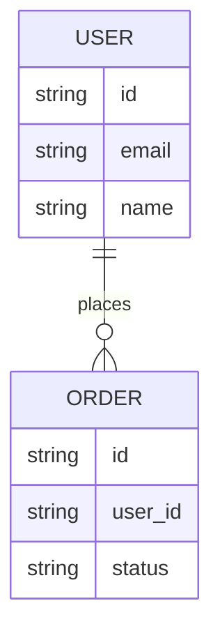

## Skill Context

This skill is part of **vstack** — a VS Code-native AI engineering workflow system.

### AskUserQuestion Format

When you need clarification, use this exact format — never invent or guess:

> **Question:** [The specific question]
> **Options:** A) … | B) … | C) …
> **Default if no response:** [What you'll do]

Never ask more than one question at a time without waiting for the answer.

### Diagram Convention

When producing hand-authored Markdown outputs, prefer Mermaid for flow,
interaction, lifecycle, state, topology, dependency, and decision diagrams when
the format is supported and improves clarity. Use ASCII as a fallback when
Mermaid is unsupported or would be less readable. Keep ASCII/text trees for
directory structures and other scan-friendly hierarchies.

# design — API & Service Design

Produce a complete service or API design document from minimal input. The output
becomes the source of truth for implementation.

## Out of scope

- Reviewing existing DX/ergonomics (use `consult`)
- Architecture review (use `architecture`)
- Implementation (engineering role)
- Contract compliance validation (use `verify` or `code-review`)

## Deliverable and artifact policy

- Primary deliverable: `docs/design/overview.md`
- Additional deliverable when user-facing scope: `docs/design/ux.md`
- Baseline-first default: write final design decisions directly to `docs/design/*.md` on the feature branch.
- Before merge: confirm design docs on the feature branch are complete before merge.

## Step 0: Understand the Domain

> **Question:** What are we designing?
> **Options:**
> A) REST API for a new service
> B) gRPC service / Protobuf schema
> C) Event-driven API (AsyncAPI / Kafka topics)
> D) Library / SDK public interface
> E) Internal service interface (service-to-service)
> **Default if no response:** A

Gather context:

```bash
# Existing code/contracts
find . -name 'openapi*' -o -name '*.proto' -o -name 'asyncapi*' 2>/dev/null | head -5
```

## Step 1: Resource Design

For each resource/entity in the domain:

1. **Name:** Plural noun (`users`, `orders`, `payments`)
1. **Ownership:** Which service owns this resource?
1. **Lifecycle:** What states can it be in?
1. **Relationships:** What resources does it reference?

Produce an entity diagram. Prefer Mermaid when possible; use ASCII as a fallback
only when Mermaid support is unavailable or would reduce clarity.



## Step 2: Endpoint Design

For each resource, define CRUD + custom actions:

```yaml
# Example
GET    /users          # List (paginated)
POST   /users          # Create
GET    /users/{id}     # Get by ID
PATCH  /users/{id}     # Update (partial)
DELETE /users/{id}     # Soft delete

# Custom actions (use sub-resources or action paths)
POST   /users/{id}/activate    # Non-CRUD action
POST   /users/{id}/deactivate
```

## Step 3: Request/Response Conventions

Define the standard envelope:

```yaml
# Success response (single resource)
{
  "data": { ... },
  "meta": { "request_id": "...", "version": "v1" }
}
# Success response (collection)
{
  "data": [ ... ],
  "pagination": {
    "cursor": "...",
    "has_next": true,
    "total": 1000
  },
  "meta": { "request_id": "...", "version": "v1" }
}

# Error response
{
  "error": {
    "code": "VALIDATION_FAILED",
    "message": "Request validation failed",
    "details": [
      { "field": "email", "issue": "Invalid email format" }
    ]
  },
  "meta": { "request_id": "...", "version": "v1" }
}
```

## Step 4: Error Code Taxonomy

Define a machine-readable error code taxonomy:

```text
# Auth errors
UNAUTHENTICATED       — No valid credentials provided
UNAUTHORIZED          — Credentials valid but permission denied
TOKEN_EXPIRED         — JWT or session token has expired
RATE_LIMITED          — Too many requests

# Validation errors
VALIDATION_FAILED     — Request body/params failed validation
INVALID_FORMAT        — Field format invalid (e.g., not a valid UUID)
MISSING_REQUIRED      — Required field absent
CONSTRAINT_VIOLATED   — Business constraint violated

# Resource errors
NOT_FOUND             — Resource doesn't exist
CONFLICT              — Resource state conflict (e.g., duplicate)
GONE                  — Resource permanently deleted

# System errors
INTERNAL_ERROR        — Unexpected server error (don't expose details)
DEPENDENCY_ERROR      — Upstream service failure
UNAVAILABLE           — Service temporarily unavailable
```

## Step 5: Versioning & Contract Discipline

Define the versioning approach:

```text
Versioning: URL path prefix (/v1/, /v2/)
Breaking change policy: 12-month minimum support after deprecation
Deprecation process:
  1. Add Deprecation header with sunset date
  2. Add X-API-Warn header with migration path
  3. Update docs with migration guide
  4. Remove version only after sunset date
```

### API Contract Checklist

- [ ] OpenAPI / AsyncAPI spec updated for any new or changed endpoints
- [ ] Breaking changes flagged (field removal, type change, required→optional, enum value removal)
- [ ] Backward-compatible changes documented (new optional fields, new enum values)
- [ ] Error response envelopes consistent with existing API conventions
- [ ] Pagination contract consistent (cursor vs offset, envelope shape)
- [ ] Rate limiting headers documented if applicable
- [ ] Authentication/authorization contracts documented
- [ ] Semver bump reflects compatibility level:
  - PATCH → bug fix, no contract change
  - MINOR → new optional fields, backward compatible
  - MAJOR → breaking change

## Step 6: Authentication & Authorization

```text
Auth mechanism: Bearer token (JWT)
Token lifecycle: Access (15min) + Refresh (30 days)
Token claims: user_id, roles[], tenant_id
Authorization model: RBAC with per-resource checks
```

## Step 7: Produce the Design Document

Output a complete design document to `docs/design/overview.md` or `openapi.yaml`:

```markdown
# API Design — [Service Name]

## Overview
[One paragraph purpose]

## Resources
[Entity diagram + table]

## Endpoints
[Endpoint table]

## Conventions
[Request/response envelope, error codes, pagination]

## Versioning
[Strategy and policy]

## Authentication
[Auth flow and token lifecycle]

## Security
[Input validation, rate limiting, CORS policy]
```

<!-- AUTO-GENERATED — maintained by vstack, do not edit directly -->
<!-- VSTACK-META: {"artifact_name":"design","artifact_type":"skill","artifact_version":"20260421013","generator":"vstack","vstack_version":"3.5.1"} -->
