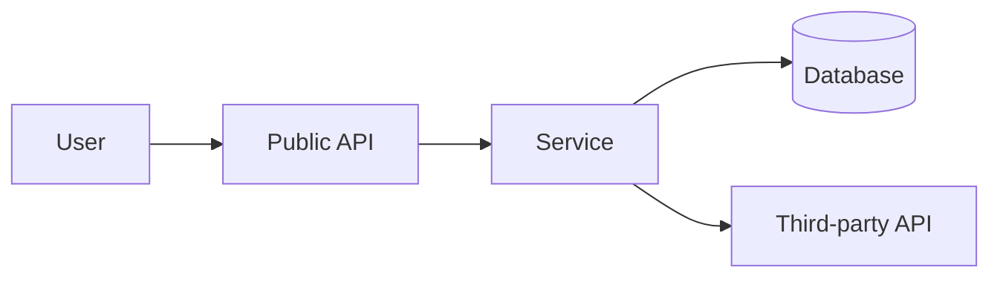

## Skill Context

This skill is part of **vstack** — a VS Code-native AI engineering workflow system.

### AskUserQuestion Format

When you need clarification, use this exact format — never invent or guess:

> **Question:** [The specific question]
> **Options:** A) … | B) … | C) …
> **Default if no response:** [What you'll do]

Never ask more than one question at a time without waiting for the answer.

### Diagram Convention

When producing hand-authored Markdown outputs, prefer Mermaid for flow,
interaction, lifecycle, state, topology, dependency, and decision diagrams when
the format is supported and improves clarity. Use ASCII as a fallback when
Mermaid is unsupported or would be less readable. Keep ASCII/text trees for
directory structures and other scan-friendly hierarchies.

```bash
# Detect base branch (main / master / develop / trunk)
BASE=$(gh pr view --json baseRefName -q .baseRefName 2>/dev/null) \
  || BASE=$(git remote show origin 2>/dev/null | grep 'HEAD branch' | awk '{print $NF}') \
  || BASE=$(git branch -r 2>/dev/null | grep -E '/(main|master|develop|trunk)' | head -1 | sed 's|.*origin/||') \
  || BASE="main"
echo "Base branch: $BASE"
```

# threat-model — Threat Modeling (STRIDE-first, DREAD/PASTA-aware)

Identify design-time security risks before implementation and turn them into
actionable mitigations.

This skill uses a practical framework selection model:

- **STRIDE** for systematic threat identification (default)
- **DREAD** for threat prioritization (optional but recommended)
- **PASTA** depth for high-criticality systems when business-risk alignment is required

## Out of scope

- Full OWASP vulnerability audit of existing code (use `security`)
- Fix implementation and patching work (engineering role)
- Incident post-mortem analysis (use `incident`)
- Generic architecture review without threat analysis focus (use `architecture`)

## Deliverable and artifact policy

- Primary deliverable: a threat model document owned by the `architect` role.
- The invoking agent determines the output path. Default (architect role): `docs/architecture/threat-model.md`.
- Baseline-first default: write the final threat model directly to the designated output path on the feature branch.
- Before merge: confirm the threat model on the feature branch is complete before merge.

## Framework selection guide

Use this decision table to choose depth and method:

| Need                                             | Preferred framework                       |
| ------------------------------------------------ | ----------------------------------------- |
| Identify threats quickly during design           | STRIDE                                    |
| Rank many discovered threats for remediation     | STRIDE + DREAD                            |
| Model business-aligned risk for critical systems | PASTA (optionally with STRIDE categories) |

Default path for most teams: **STRIDE + DREAD**.

## Step 0: Define model scope and trust boundaries

Document what is in and out of scope:

```text
System:          [service/subsystem/repo scope]
System style:    [backend-only|frontend-only|fullstack|platform|integration]
Critical assets: [PII, credentials, payment data, business operations]
Actors:          [users, admins, services, third parties]
Trust boundaries:[internet edge, auth boundary, network segment, tenant boundary]
Assumptions:     [known constraints]
Out of scope:    [explicit exclusions]
```

Collect architecture evidence first:

```bash
find docs -maxdepth 3 -type f \
  \( -name 'overview.md' -o -name 'requirements.md' -o -name 'openapi*.yaml' -o -name '*.proto' \) \
  2>/dev/null | sort
```

If there is no architecture or design context, stop and request it before continuing.

## Step 1: Build a lightweight system model

Create a concise component and data-flow view before threat enumeration.

Minimum required model:

1. External entities (users, services, vendors)
1. Internal components/services
1. Data stores
1. Data flows crossing trust boundaries
1. Identity and authorization boundaries

Use Mermaid when possible:



## Step 2: Identify threats with STRIDE

For each component and data flow, enumerate threats by category.

| STRIDE category        | Core question                                     | Typical controls                              |
| ---------------------- | ------------------------------------------------- | --------------------------------------------- |
| Spoofing               | Can an attacker impersonate an identity?          | Strong auth, token validation, mTLS           |
| Tampering              | Can data/state be modified without authorization? | Integrity checks, signatures, immutable logs  |
| Repudiation            | Could actions be denied without evidence?         | Audit trails, non-repudiation logs            |
| Information Disclosure | Could sensitive data leak?                        | Access control, encryption, data minimization |
| Denial of Service      | Can availability be degraded or exhausted?        | Rate limits, quotas, circuit breakers         |
| Elevation of Privilege | Can lower privilege gain higher access?           | Least privilege, authorization hardening      |

Threat entry format:

```text
ID: TM-<component>-<n>
Category: [STRIDE]
Asset: [what is at risk]
Attack path: [how the threat is realized]
Preconditions: [what attacker needs]
Current controls: [what already exists]
Control gaps: [what is missing]
Proposed mitigations: [specific, testable controls]
```

## Step 3: Prioritize with DREAD (optional but recommended)

If you have more than a few threats, score each threat:

- **Damage**
- **Reproducibility**
- **Exploitability**
- **Affected Users**
- **Discoverability**

Use a 1-10 scale and compute the average.

| ID        | D   | R   | E   | A   | Dv  | Score | Priority |
| --------- | --- | --- | --- | --- | --- | ----- | -------- |
| TM-auth-1 | 9   | 8   | 8   | 9   | 7   | 8.2   | P1       |

Prioritization note: keep scoring criteria explicit and tie final priority to
business and operational context, not score alone.

## Step 4: Use PASTA depth when context demands it

Use PASTA selectively when one or more conditions apply:

- System is mission-critical or highly regulated
- Executive/compliance risk reporting requires business traceability
- Threat model must include attack simulation beyond checklist-level analysis

PASTA-aligned expansion (compact):

1. Define business and security objectives.
1. Confirm technical scope and decomposition.
1. Extend threat analysis with vulnerability and attack simulation depth.
1. Translate findings into business-impact risk prioritization.

If PASTA depth is out of scope due to time or maturity constraints, document that
explicitly and continue with STRIDE + DREAD.

## Step 5: Produce mitigation plan and security requirements

Convert prioritized threats into implementation-ready controls:

1. Preventive controls (before exploitation)
1. Detective controls (signal and alert)
1. Response controls (contain and recover)
1. Verification controls (tests/checks proving control effectiveness)

For each high-priority threat include:

- Owner (role/team)
- Expected artifact change (architecture, design, code, tests, runbook)
- Deadline/sprint target
- Verification method (test, scan, review, chaos/failure drill)

## Threat model report template

```markdown
# Threat Model — [System] — [Date]

## Scope and Context

- System and boundaries
- Critical assets
- Assumptions and exclusions

## Architecture and Data Flow

[diagram + concise narrative]

## STRIDE Threat Inventory

| ID | Component/Flow | Category | Threat | Current Controls | Gaps | Mitigation |

## DREAD Prioritization (if used)

| ID | Damage | Reproducibility | Exploitability | Affected Users | Discoverability | Score | Priority |

## PASTA Expansion (if used)

[business objectives, attack simulation summary, business-impact alignment]

## Priority Mitigation Plan

| Priority | Threat ID | Control | Owner | Verification | Target |

## Residual Risk and Decisions

- accepted risks
- escalations needed
- decisions requiring ADR or product sign-off
```

## Completion checklist

- Scope, trust boundaries, and critical assets are explicit.
- STRIDE inventory covers all major components and critical flows.
- DREAD prioritization is included when threat volume requires ranking.
- PASTA depth is either applied with rationale or explicitly deferred.
- Mitigations are actionable, owned, and verifiable.
- Final report is written to `docs/architecture/threat-model.md`.

<!-- AUTO-GENERATED — maintained by vstack, do not edit directly -->
<!-- VSTACK-META: {"artifact_name":"threat-model","artifact_type":"skill","artifact_version":"20260502021","generator":"vstack","vstack_version":"3.5.1"} -->
