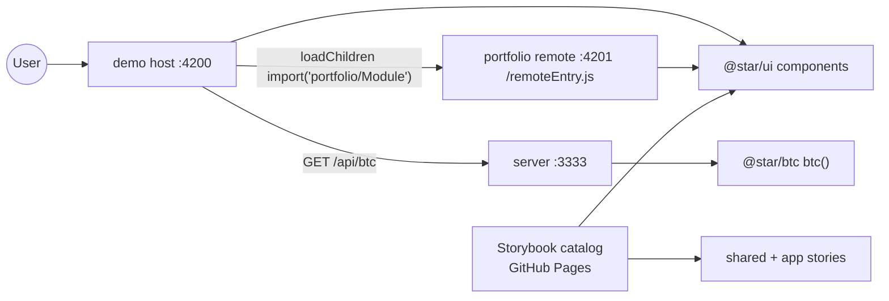

# Current-State Snapshot (End State to Preserve)

<!-- Preservation baseline captured before the from-scratch rebuild. -->

> Maintained by: **architect** role\
> Last updated: 2026-07-03\
> Purpose: freeze the observable end state so the rebuild on the latest toolchain is behaviour-preserving.

## overview

`nx-reference` is a reference Nx monorepo demonstrating **Atomic Design + Storybook + Module
Federation** in Angular. It ships:

- a **Module Federation demo**: a host app (`demo`) that lazy-loads a remote app (`portfolio`) at
  runtime, and
- a **deployed Storybook catalog** of a custom Angular UI component library.

**System style:** frontend-heavy fullstack (Angular UI + MF + a minimal Express API).

This snapshot is the contract the rebuild must satisfy. It records the **behaviour and design**, not
the legacy implementation details (which are being replaced).

## legacy toolchain (being replaced)

| Concern | Version |
| --- | --- |
| Nx / `@nrwl/*` | 13.0.2 |
| Angular | 12.2.11 |
| Module Federation | `@angular-architects/module-federation` ^12.5.3 (webpack `ModuleFederationPlugin`) |
| Storybook | 6.3 (webpack5 builder) |
| Unit tests | Jest 27 (`jest-preset-angular` 10) |
| e2e | Cypress 6 |
| Docs | Compodoc 1.1 (`documentation.json` feeds Storybook docs) |
| Package manager | Yarn 1 |
| npm scope | `@star` |

## system structure (current)

```text
nx-reference/
├── apps/
│   ├── demo/            # MF HOST — Angular app, Storybook catalog host, dev :4200
│   ├── demo-e2e/        # Cypress e2e for demo
│   ├── portfolio/       # MF REMOTE — Angular app, dev :4201, exposes ./Module
│   ├── portfolio-e2e/   # Cypress e2e for portfolio
│   ├── server/          # Express API, :3333, GET /api/btc
│   └── ui-e2e/          # Cypress e2e for ui storybook
├── libs/
│   ├── ui/              # @star/ui — custom Angular component library (+ Storybook stories)
│   ├── btc/             # @star/btc — pure fn btc(): random rate
│   └── shared/
│       ├── types/           # @star/shared/types — Rate, BtcResponse, LogItem, Severity, IMessageService
│       ├── services/        # @star/shared/services — MessageService
│       └── data-access/     # @star/shared/data-access — BtcRateService
├── .storybook/         # root Storybook config (aggregated by demo app)
└── public/             # static assets
```

## components and runtime topology



- **`demo` (MF host):** `RouterModule.forRoot([{ path: '', loadChildren: () => import('portfolio/Module').then(m => m.RemoteEntryModule) }], { initialNavigation: 'enabledBlocking' })`. Renders the app shell (`star-app-template`), an exchange-rate panel (get-rate button, rates table), and severity-filtered alerts.
- **`portfolio` (MF remote):** exposes `./Module` → `RemoteEntryModule` (route `''` → `RemoteEntryComponent`), consuming `@star/ui`.
- **`server`:** Express + cors; `GET /api` → welcome; `GET /api/btc` → `{ btc: number }` via `@star/btc`.
- **Storybook:** the `demo` app's Storybook aggregates stories from `demo`, `libs/ui`, and
  `libs/shared/**`. Deployed static to GitHub Pages. Does **not** load the MF remote — it is a
  component catalog. Compodoc `documentation.json` supplies component/input docs.

## MF wiring (current, being modernised)

- Host remotes map: dev `portfolio@http://localhost:4201/remoteEntry.js`; prod
  `portfolio@https://code-star.github.io/nx-reference-portfolio/remoteEntry.js`.
- Shared singletons (strictVersion): `@angular/core`, `@angular/common`, `@angular/common/http`,
  `@angular/router`, plus workspace shared-mappings.
- `main.ts` uses the dynamic-import bootstrap pattern (`import('./bootstrap')`).

## UI component library (design contract — MUST preserve)

Selector prefix `star-`. Components + one pipe:

| Component | Selector | Inputs | Role (Atomic Design) |
| --- | --- | --- | --- |
| PrimaryButton | `star-primary-button` | `disabled: boolean` | atom |
| LoadingButton | `star-loading-button` | `loading: boolean` | molecule (wraps PrimaryButton + Icon) |
| Icon | `star-icon[type]` | `type: 'loading'\|'home'\|'code'\|'star'` | atom (inline SVG) |
| Paper | `star-paper` | — (content projection) | atom (card) |
| Alert | `star-alert[item]` | `item: LogItem` | molecule |
| RatesTable | `star-rates-table` | `rates: [number, Rate][]` | molecule |
| AppTemplate | `star-app-template[title]` | `title: string` | template (nav + header + main) |
| BySeverity (pipe) | `bySeverity` | `(LogItem[], Severity)` | pure pipe filter |

**Design tokens (must be visually identical):**

- Primary/accent: `#e87e00` (orange); disabled primary: `#533106`.
- Backgrounds: default `#002042`, card/paper `#001329`; text white.
- Paper radius `8px`; button radius `4px`, uppercase bold, Material-like shadow.
- Alert palettes: error `rgb(250,179,174)` on `rgb(24,6,5)`; info `rgb(166,213,250)` on `rgb(3,14,24)`.
- Loading icon spins (`@keyframes spin`, 2s linear infinite).
- AppTemplate: fixed left orange nav (home/code/star icons), navy header with title, main content area; `sans-serif`; spacing unit `4px`.
- Icons: inline SVG `viewBox="0 0 24 24"` for `loading|home|code|star`.

## business logic (must preserve)

- `btc(): Rate` → `Math.random() * 100000`.
- `BtcRateService.getRate()` → HTTP GET to `api/btc`; **1s delay**; on success logs `fetched rate`
  (info) and maps to `[Date.now(), btc]`; on error logs `getRate failed: …` (error) and returns
  undefined result. URL is `api/btc` when host is `code-star.github.io`, else
  `http://localhost:3333/api/btc`.
- `MessageService.log()` **replaces** the `logs` array (immutable) so a pure pipe can filter it;
  `clear()` empties it. Implements `IMessageService`; provided app-wide via
  `{ provide: IMessageService, useExisting: MessageService }`.
- `bySeverity` filters `LogItem[]` by `severity`. Demo shows `error` alerts then `info` alerts.

## behaviour to reproduce (acceptance)

1. `demo` boots, shows app shell + exchange-rate panel; on init auto-fetches one rate.
2. Clicking "get new exchange rate" disables the button + shows spinner for ~1s, then appends a row.
3. Remote `portfolio` renders inside `demo` via MF at route `''`.
4. `server` returns `{ btc }` at `/api/btc`.
5. `build-storybook` produces a static catalog of all UI/shared/app stories with compodoc docs and an
   intro page; deployable to GitHub Pages.

## test/coverage baseline

- **18 Jest spec files** (2 in `demo`, 1 in `portfolio`, 1 `btc`, 3 shared, 9 in `ui` incl. pipe, +
  e2e specs). Target: parity of unit coverage after rebuild.
- **10 story files** (7 UI component stories + app + 2 MDX: intro, message service).

## coupling / path aliases

`tsconfig.base.json` paths: `@star/btc`, `@star/ui`, `@star/shared/types`, `@star/shared/services`,
`@star/shared/data-access`. Dependency direction: apps → ui → shared/types; ui/services/data-access →
shared/types; server → btc + shared/types.
