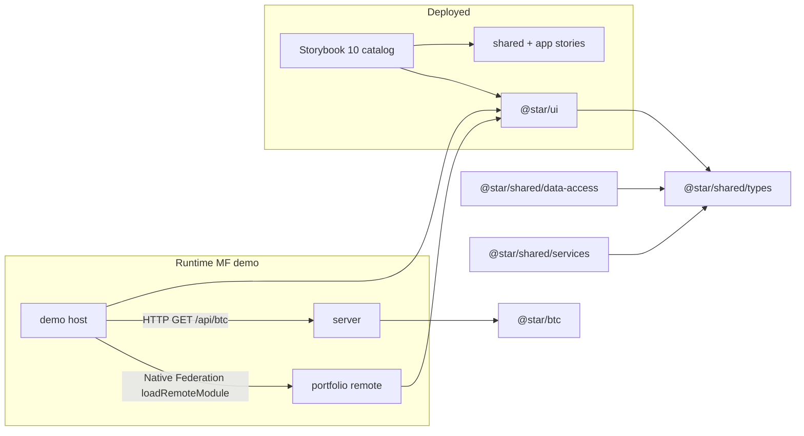

# Architecture Overview

> Maintained by: **architect** role\
> Last updated: 2026-07-03

## overview

`nx-reference` is a reference monorepo that demonstrates **Module Federation in Nx with Angular**,
with a custom UI component library **published as a deployed Storybook catalog**. This document
describes the **target architecture** for the rebuild on the latest toolchain (Nx 23 / Angular 21 /
Storybook 10). It preserves the behaviour and design captured in
[`current-state.md`](./current-state.md).

**System style:** frontend-heavy fullstack — Angular UI + runtime Module Federation + a minimal
Express API. UI atoms/molecules/templates follow Atomic Design.

## system structure

```text
nx-reference/
├── apps/
│   ├── demo/            # MF HOST (Angular, standalone) + Storybook catalog host
│   ├── portfolio/       # MF REMOTE (Angular, standalone), exposes ./remoteEntry
│   └── server/          # Express API (GET /api/btc)
├── libs/
│   ├── ui/              # @star/ui — standalone components + pipe + stories
│   ├── btc/             # @star/btc — pure rate fn
│   └── shared/
│       ├── types/           # @star/shared/types
│       ├── services/        # @star/shared/services (MessageService)
│       └── data-access/     # @star/shared/data-access (BtcRateService)
└── docs/                # architecture / design / adr / reports (audit trail)
```

## components



- **`demo` (host):** standalone bootstrap (`bootstrapApplication`), `provideRouter`,
  `provideHttpClient`, zoneless. Route `''` lazy-loads the `portfolio` remote via Native Federation
  `loadRemoteModule({ remoteName: 'portfolio', exposedModule: './Routes' })`, with a fallback route.
  Renders the app shell, exchange-rate panel, and severity-filtered alerts.
- **`portfolio` (remote):** standalone bootstrap; exposes `./Routes` through Native Federation
  (`federation.config.js`); consumes `@star/ui`.
- **`server`:** Express + cors; `GET /api/btc` → `{ btc }` from `@star/btc`.
- **`@star/ui`:** standalone components + `bySeverity` pipe; the single source of visual design;
  drives the Storybook catalog.
- **shared libs:** `types` (contracts), `services` (MessageService), `data-access` (BtcRateService).

## principles

1. **Behaviour- and design-preserving rebuild.** The observable end state in `current-state.md` is the
   acceptance contract. Selectors, input contracts, template output, and SCSS tokens stay identical.
2. **Latest Angular idioms.** Standalone components, signal inputs (`input()`), `inject()`, new
   control flow (`@if`/`@for`/`@switch`), `provide*` bootstrap — no NgModules in new code
   (see ADR-0006).
3. **Native Federation (the newest Nx-endorsed Angular MF method).** `@nx/angular:host/remote`
   (webpack `withModuleFederation`) is deprecated in Nx 23 / removed in v24; Nx redirects Angular
   users to `@angular-architects/native-federation` on the esbuild `application` builder
   (see ADR-0003) — no legacy webpack MF wrapper.
4. **Storybook is a component catalog, not the running app.** The MF demo runs via `nx serve`; the
   deployed Storybook showcases `@star/ui` + stories (see ADR-0004).
5. **Baseline-first, phase-by-phase delivery.** Each phase validates (typecheck → lint → test →
   build) and lands a conventional commit before the next.
6. **Single UI source of truth.** All visual design lives in `@star/ui`; apps compose it.

## data flow

1. `demo` boots → auto-fetches one rate. `BtcRateService.getRate()` issues `GET /api/btc`
   (`localhost:3333` in dev, same-origin on GitHub Pages), applies a 1s delay, logs an info message,
   maps to `[Date.now(), btc]`, and the rates table appends a row.
2. Errors are logged (error severity) via `MessageService`, which replaces its `logs` array
   immutably; `bySeverity` (pure pipe) filters them into `Alert` blocks.
3. At route `''`, `demo` lazy-loads the `portfolio` remote's `./Routes` over Native Federation and
   renders it inline; a fallback route covers the remote being unavailable.
4. Storybook build renders `@star/ui` + shared/app stories into a static site with compodoc docs.

## as-built resolutions

The Phase-0 open questions below were resolved during implementation:

- **MF method → Native Federation.** The Nx webpack MF generators are deprecated/removed; the
  esbuild-based `@angular-architects/native-federation` is the newest Angular path (ADR-0003).
- **Storybook builder → `@storybook/angular` 10 (webpack) + compodoc.** MDX and compodoc both work on
  Angular 21; explicit `@storybook/angular:build-storybook` targets with `experimentalZoneless` are
  used because SB10 rejects the legacy CLI build path (ADR-0004).
- **Test runner → Jest.** Kept for spec parity; no ESM friction encountered on Angular 21 (ADR-0005).

## non-functional requirements

- **Compatibility:** Node 20+ (Node 24 present); modern evergreen browsers.
- **Build/DX:** `nx serve demo` + `nx serve portfolio` run the MF demo; `nx run demo:build-storybook`
  produces the deployable catalog; `nx run-many -t lint,test,build` is green.
- **Reliability:** rate fetch failures degrade gracefully (logged alert, no crash) — preserved.
- **Deployability:** Storybook static output hostable on GitHub Pages with correct base-href; prod
  remote URL configurable to the Pages URL.
- **Security posture:** demo-grade; server has no secrets; cors open (unchanged, demo scope).

## key decisions

- [ADR-0001](./adr/0001-rebuild-from-scratch.md) — Rebuild from scratch vs incremental migration.
- [ADR-0002](./adr/0002-target-stack.md) — Target stack: Nx 23 / Angular 21 / Storybook 10.
- [ADR-0003](./adr/0003-module-federation-method.md) — Nx-native Module Federation method.
- [ADR-0004](./adr/0004-storybook-catalog.md) — Storybook 10 as the deployed component catalog.
- [ADR-0005](./adr/0005-testing-strategy.md) — Testing strategy & coverage parity.
- [ADR-0006](./adr/0006-standalone-signals.md) — Standalone components + signal APIs.

## open questions

_All Phase-0 open questions have been resolved — see **as-built resolutions** above._
