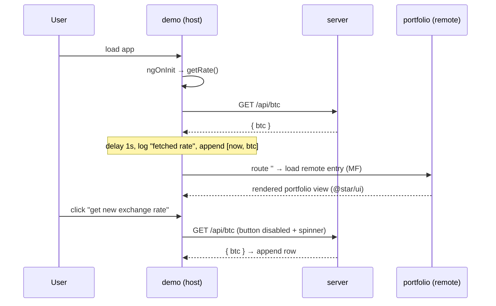

# Design Overview

> Maintained by: **designer** role\
> Last updated: 2026-07-03

## overview

This design translates the target architecture (see
[`docs/architecture/overview.md`](../architecture/overview.md)) into implementable contracts for the
rebuild. Scope is **fullstack, frontend-heavy**: a standalone-Angular UI library, a Module Federation
host+remote pair, a minimal Express API, and a deployed Storybook catalog. Detailed component design
tokens and interfaces live in [`components.md`](./components.md); user flows in [`ux.md`](./ux.md).
All contracts must reproduce the behaviour recorded in
[`current-state.md`](../architecture/current-state.md).

## domain model

| Entity | Definition | Notes |
| --- | --- | --- |
| `Rate` | `number` | BTC price in EUR. |
| `BtcResponse` | `{ btc: Rate }` | Server payload from `GET /api/btc`. |
| `Severity` | `'info' \| 'error'` | Log/alert classification. |
| `LogItem` | `{ severity: string; message: string }` | Message-service entry; `severity` typed loosely for compatibility. |
| `DateAndRate` | `[number, Rate]` | `[epochMillis, rate]` tuple rendered by the rates table. |
| `IMessageService` | `{ logs: LogItem[]; log(msg, severity): void }` | Abstract token; `MessageService` is the impl, bound via `provide`. |

**MessageService lifecycle:** `log()` produces a **new** `logs` array (never mutates) so a pure pipe
(`bySeverity`) can detect changes; `clear()` resets to `[]`.

## interfaces

### Shared libraries

- `@star/shared/types` — exports `Rate`, `BtcResponse`, `Severity`, `LogItem`, `IMessageService`.
- `@star/btc` — `btc(): Rate` → `Math.random() * 100000`.
- `@star/shared/services` — `MessageService implements IMessageService` (root-provided).
- `@star/shared/data-access` — `BtcRateService` with `getRate(): Observable<DateAndRate>`.
- `@star/ui` — standalone components + `bySeverity` pipe (see `components.md`).

### `BtcRateService.getRate()` contract

- Issues `GET` to `api/btc` when `window.location.hostname === 'code-star.github.io'`, else
  `http://localhost:3333/api/btc`.
- Pipes: `delay(1000)` → `tap` log `"SHARED-BtcRateService: fetched rate"` (info) →
  `map(({ btc }) => [Date.now(), btc])` → `catchError` log
  `"SHARED-BtcRateService: getRate failed: <message>"` (error) and emit `undefined` result.
- Uses `inject(HttpClient)` and `inject(IMessageService)`.

### Server API

| Method | Path | Response | Status |
| --- | --- | --- | --- |
| GET | `/api` | `{ message: "Welcome to server!" }` | 200 |
| GET | `/api/btc` | `{ btc: number }` (`BtcResponse`) | 200 |

CORS enabled (open). Port `process.env.port || 3333`.

### Module Federation contract

- **Remote `portfolio`:** exposes its entry (route/component) via Nx MF `exposes`
  (`module-federation.config.ts`). Dev port `4201`. Renders a portfolio view using `@star/ui`.
- **Host `demo`:** declares `portfolio` as a remote; route `''` lazy-loads the remote's exposed entry
  (`loadChildren`/`loadComponent`) with blocking initial navigation. Shared singletons: `@angular/core`,
  `@angular/common`, `@angular/common/http`, `@angular/router` (managed by `withModuleFederation`).
- Prod remote URL points to the GitHub Pages deployment; dev URL is `localhost:4201`.

## data flows

## error contract

- Rate fetch failure: no throw; `BtcRateService` logs an **error** `LogItem` and emits `undefined`;
  the UI keeps working. Errors surface as `star-alert` blocks (error styling) above info alerts.
- Remote load failure (MF): host shows its fallback/degraded route (preserve current fallback intent).
- Server errors are logged to stderr; demo scope, no structured error envelope required.

## design principles

- **Contracts frozen at the public surface:** exported symbols, selectors, `@Input` names/types, and
  API shapes match `current-state.md` exactly. Implementation modernises (ADR-0006), contracts do not.
- **UI is the single design source:** apps compose `@star/ui`; no duplicated styling in apps beyond
  thin layout glue.
- **Immutability for pure pipes:** `MessageService` returns new arrays; `bySeverity` stays pure.
- **Explicit MF boundaries:** only the exposed remote entry crosses the host/remote boundary.

## open questions

- Exact standalone MF exposure shape (route vs component) is finalised by the Nx generator output in
  Phase 4; the host route wiring adapts to it.
- Whether compodoc remains the docs source for Storybook `argTypes` (see ADR-0004) — confirmed in
  Phase 7.
